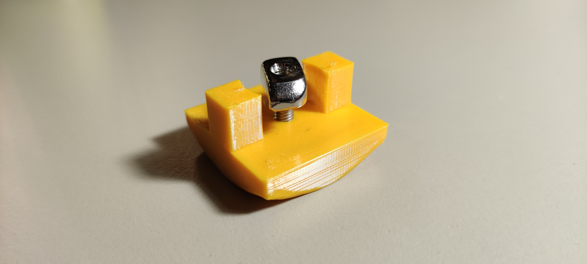
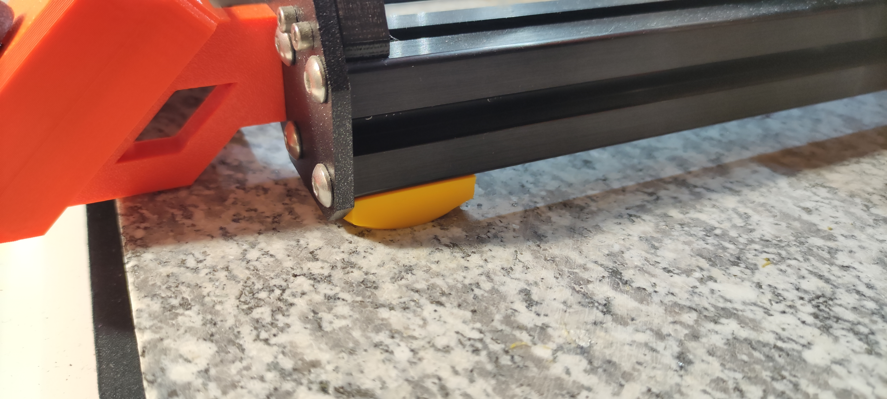

# Prusa i3 hard feet
It is widely accepted that, if using a heavy base (such as a paver stone)
for your Prusa i3, it is better to use hard feet that are able to transfer
vibrations onto the mass, as opposed to the vibration-dampening stock feet.

I couldn't find any models of hard feet that were fastened with t-nuts,
which seemed like the logical choice, given how you want the tightest possible
coupling, so I whipped this up in OpenSCAD. Ringing test appears to show
minor improvement over Y axis, and the printer seems quieter overall.

The feet have (by default) the ~same height as the stock ones, so clearances
aren't an issue.

## Build manual

### Bill of materials
| **Item**            | **Quantity**   |
|:----------------|------------:
| foot            |          4 |
| M4 3030 T-nut   |          4 |

### Quick build
Download the model from [printables.com](https://www.printables.com/model/328141-prusa-i3-t-nut-mounted-hard-feet).

### Process
0. Print out 4 copies of the `foot`. I printed mine in TPU with plenty of perimeters.
1. Drill/puncture through the single layer covering the bolt hole.
2. Remove the stock anti-vibration feet.
3. Mount the printed feet with t-nuts onto the bottom of extrusions.

### Customizing
You can also customize the feet (for example, make them taller) by cloning the
source code and playing with `foot.scad`. All of the values can also be changed
using the OpenSCAD Customizer.
